[roboken/PWM\_ISOLATION at main · shimogamo/roboken · GitHub](https://github.com/shimogamo/roboken/tree/main/PWM_ISOLATION)

## 回路構成
PWM_ISOLATION回路の構成
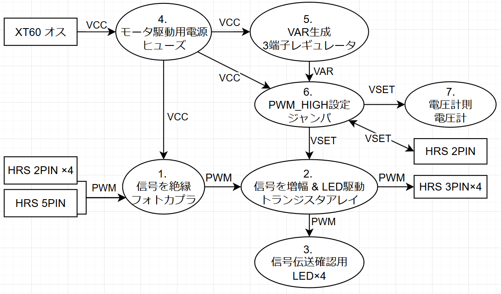

## 動作検証(2024/12/02)
### 仕様
設計仕様は、部室にあったサーボモーターDS3225のデータシート通り
PWM周期は通常20ms(つまり、PWM周波数 50Hz)
ON時間は0.5～2.5msを0～180°または0～270°に対応させる。
このサーボモータのPWMのHIGH電圧は3.3～5Vであり、今回製作した回路のVSETをこの値に設定する。
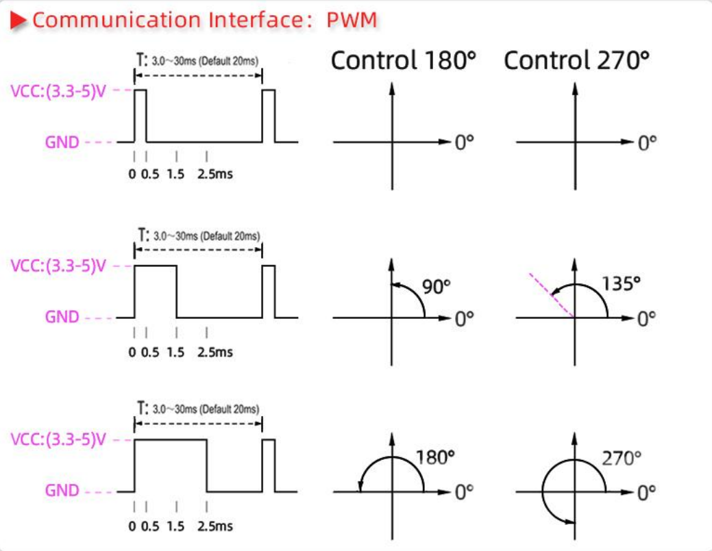
### 概観
表
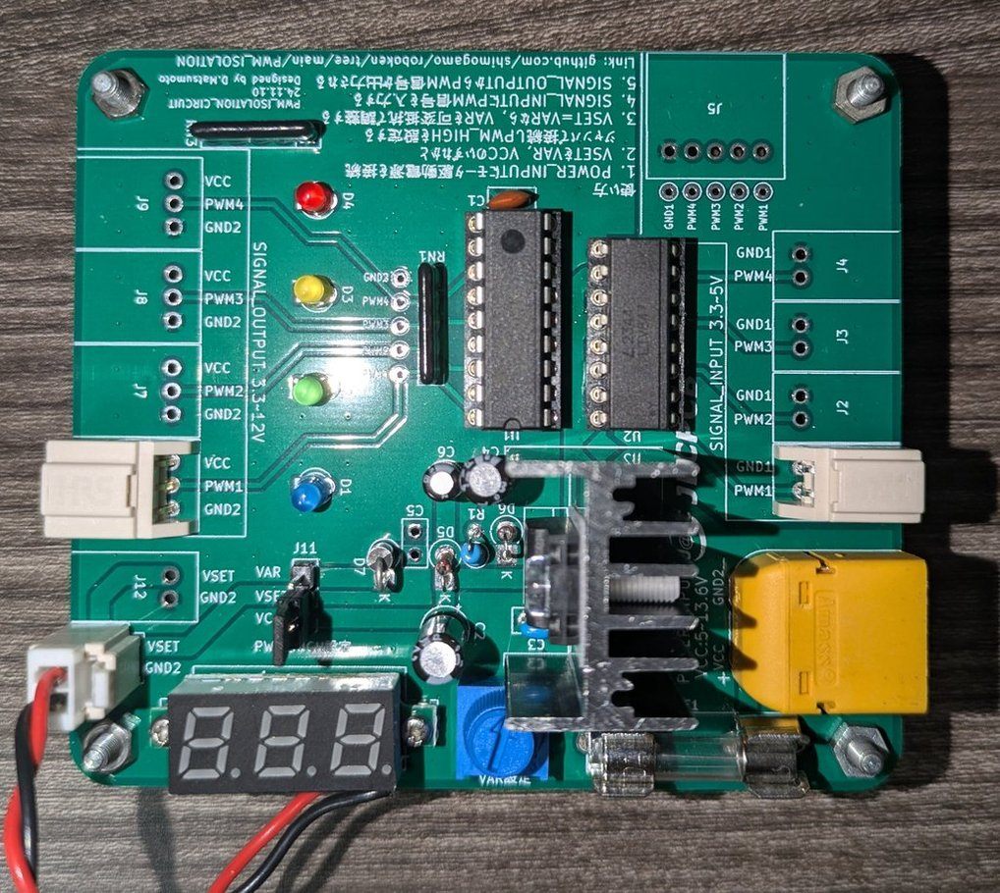
裏
動作にミスがあったので、フォトカプラのPWM1ピンのみ1kΩの抵抗をつけている。
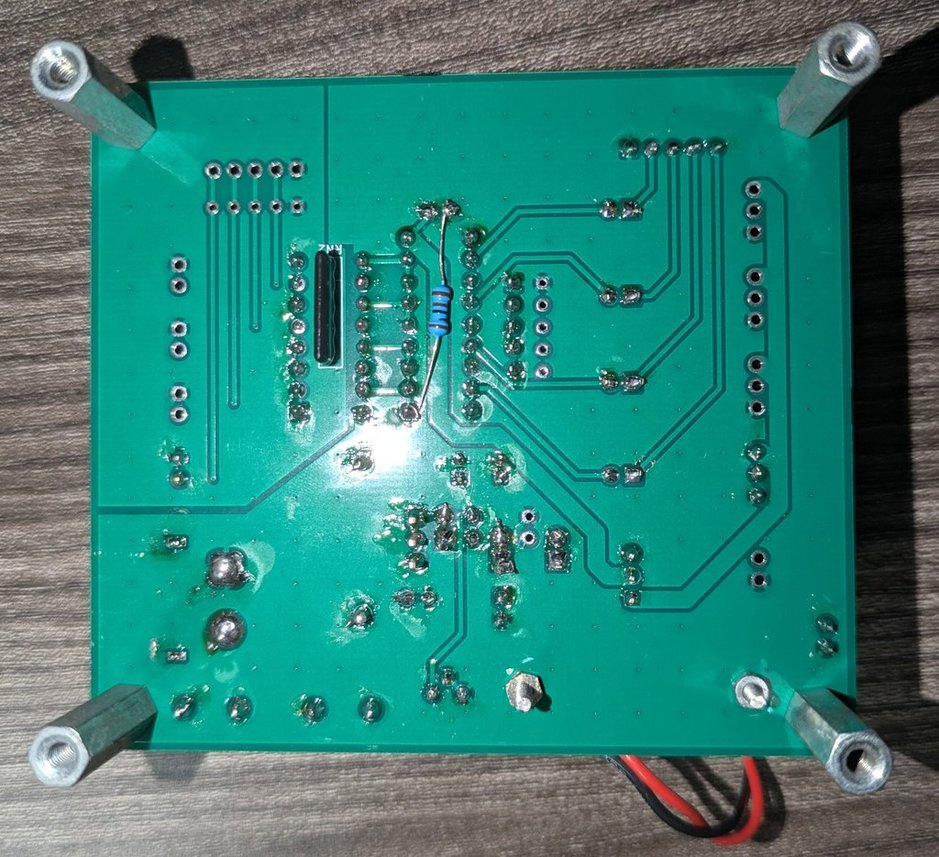
### 動作テスト
周期20msに対しON時間は0.5～2.5msなので、デューティ比は2.5～12.5%の間を変化することになる。入力のPWM信号はPWM1～PWM4の4つある。その後、フォトカプラとトランジスタに入力されて出力される。
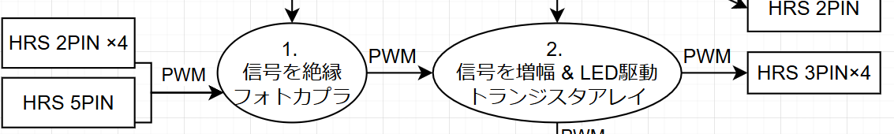
青：50Hz, 3.3Vの入力信号(PWM1, PWM2)
赤：PWM1の出力信号
黄：PWM2の出力信号

#### デューティ比 2.5%のとき
-  フォトカプラの出力
PWM1はすぐに放電が終了している
PWM2は放電時間がが長すぎる
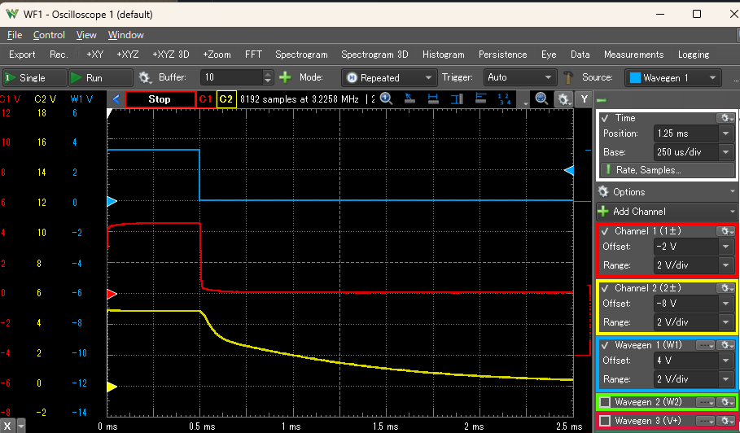
- トランジスタの出力
PWM1は少し充放電波形っぽい応答になっているが、パルス幅は概ね同じ
PWM2はパルス幅が2倍以上ずれている...
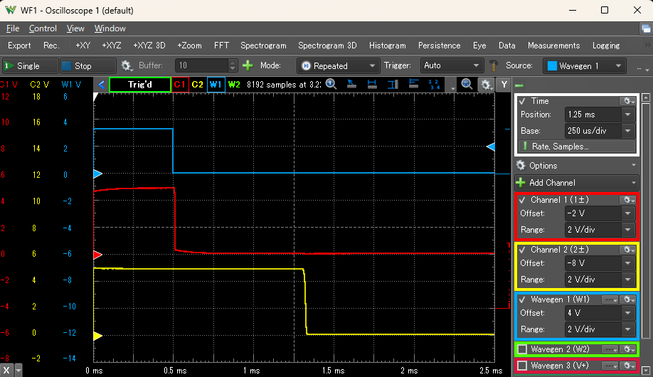
####  デューティ比 5%のとき
- フォトカプラの出力
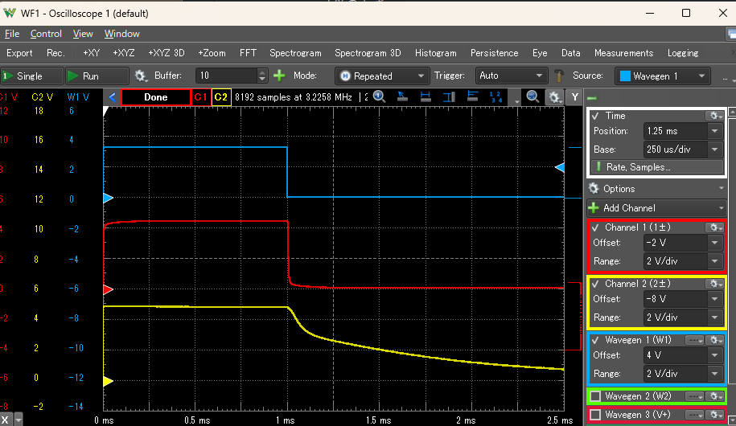
- トランジスタの出力
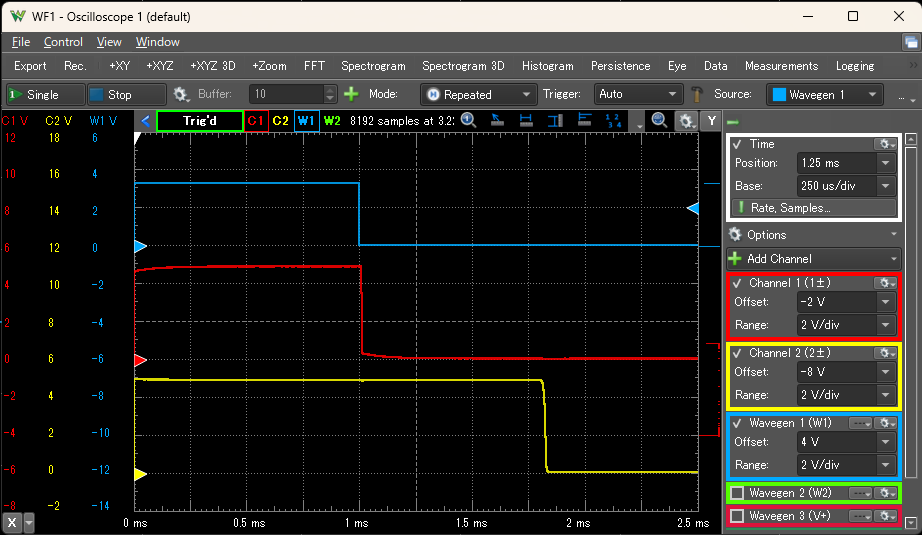
#### デューティ比 12.5%のとき
-  フォトカプラの出力
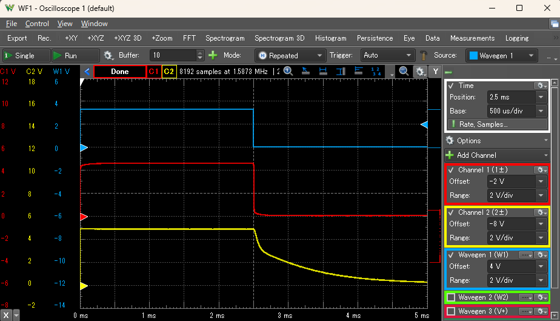
- トランジスタの出力
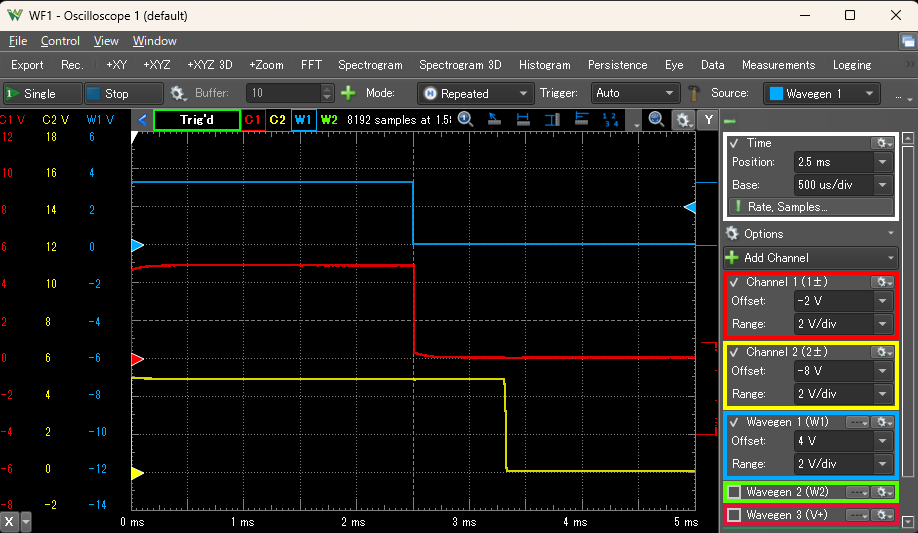
